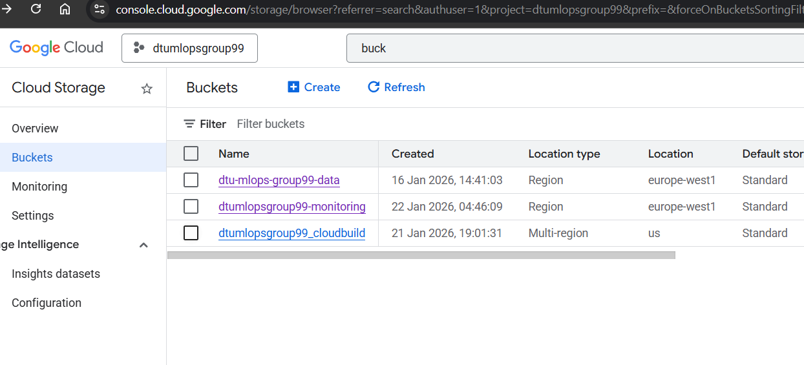
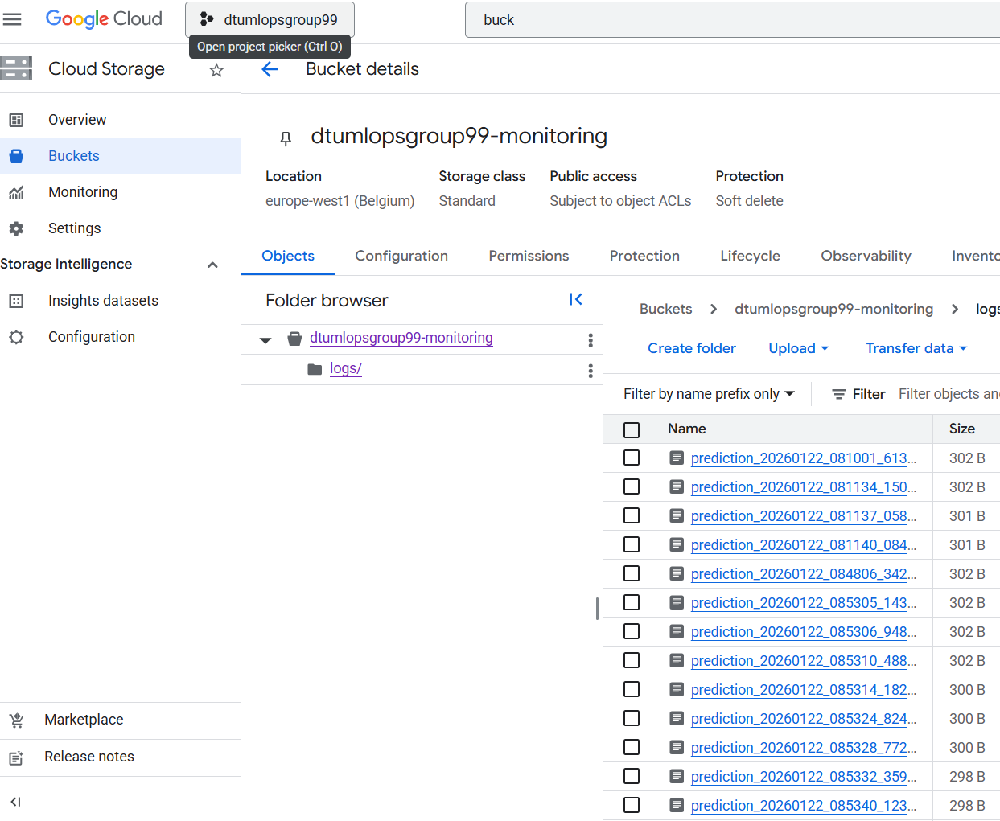
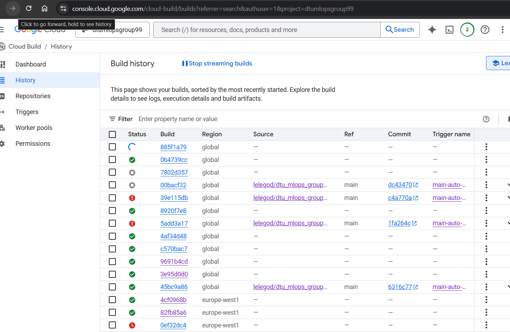
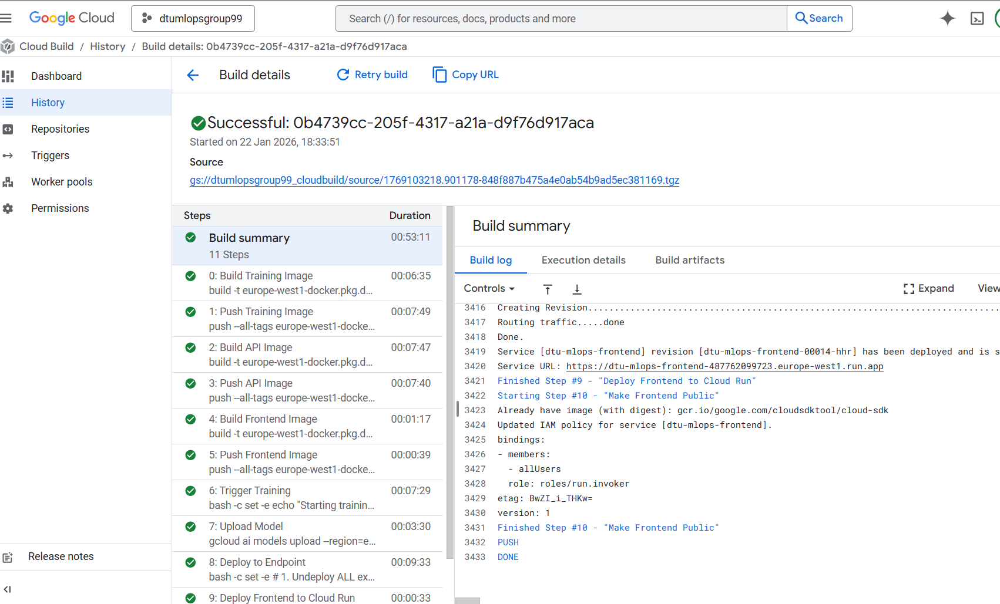

# Exam template for 02476 Machine Learning Operations

This is the report template for the exam. Please only remove the text formatted as with three dashes in front and behind
like:

```--- question 1 fill here ---```

Where you instead should add your answers. Any other changes may have unwanted consequences when your report is
auto-generated at the end of the course. For questions where you are asked to include images, start by adding the image
to the `figures` subfolder (please only use `.png`, `.jpg` or `.jpeg`) and then add the following code in your answer:

``

In addition to this markdown file, we also provide the `report.py` script that provides two utility functions:

Running:

```bash
python report.py html
```

Will generate a `.html` page of your report. After the deadline for answering this template, we will auto-scrape
everything in this `reports` folder and then use this utility to generate a `.html` page that will be your serve
as your final hand-in.

Running

```bash
python report.py check
```

Will check your answers in this template against the constraints listed for each question e.g. is your answer too
short, too long, or have you included an image when asked. For both functions to work you mustn't rename anything.
The script has two dependencies that can be installed with

```bash
pip install typer markdown
```

or

```bash
uv add typer markdown
```

## Overall project checklist

The checklist is *exhaustive* which means that it includes everything that you could do on the project included in the
curriculum in this course. Therefore, we do not expect at all that you have checked all boxes at the end of the project.
The parenthesis at the end indicates what module the bullet point is related to. Please be honest in your answers, we
will check the repositories and the code to verify your answers.

### Week 1

* [x] Create a git repository (M5)
* [x] Make sure that all team members have write access to the GitHub repository (M5)
* [x] Create a dedicated environment for you project to keep track of your packages (M2)
* [x] Create the initial file structure using cookiecutter with an appropriate template (M6)
* [x] Fill out the `data.py` file such that it downloads whatever data you need and preprocesses it (if necessary) (M6)
* [x] Add a model to `model.py` and a training procedure to `train.py` and get that running (M6)
* [x] Remember to fill out the `requirements.txt` and `requirements_dev.txt` file with whatever dependencies that you
    are using (M2+M6)
* [x] Remember to comply with good coding practices (`pep8`) while doing the project (M7)
* [x] Do a bit of code typing and remember to document essential parts of your code (M7)
* [x] Setup version control for your data or part of your data (M8)
* [x] Add command line interfaces and project commands to your code where it makes sense (M9)
* [x] Construct one or multiple docker files for your code (M10)
* [x] Build the docker files locally and make sure they work as intended (M10)
* [x] Write one or multiple configurations files for your experiments (M11)
* [x] Used Hydra to load the configurations and manage your hyperparameters (M11)
* [x] Use profiling to optimize your code (M12)
* [x] Use logging to log important events in your code (M14)
* [x] Use Weights & Biases to log training progress and other important metrics/artifacts in your code (M14)
* [x] Consider running a hyperparameter optimization sweep (M14)
* [ ] Use PyTorch-lightning (if applicable) to reduce the amount of boilerplate in your code (M15)

### Week 2

* [x] Write unit tests related to the data part of your code (M16)
* [x] Write unit tests related to model construction and or model training (M16)
* [x] Calculate the code coverage (M16)
* [x] Get some continuous integration running on the GitHub repository (M17)
* [x] Add caching and multi-os/python/pytorch testing to your continuous integration (M17)
* [x] Add a linting step to your continuous integration (M17)
* [x] Add pre-commit hooks to your version control setup (M18)
* [x] Add a continues workflow that triggers when data changes (M19)
* [x] Add a continues workflow that triggers when changes to the model registry is made (M19)
* [x] Create a data storage in GCP Bucket for your data and link this with your data version control setup (M21)
* [x] Create a trigger workflow for automatically building your docker images (M21)
* [x] Get your model training in GCP using either the Engine or Vertex AI (M21)
* [x] Create a FastAPI application that can do inference using your model (M22)
* [x] Deploy your model in GCP using either Functions or Run as the backend (M23)
* [x] Write API tests for your application and setup continues integration for these (M24)
* [x] Load test your application (M24)
* [ ] Create a more specialized ML-deployment API using either ONNX or BentoML, or both (M25)
* [x] Create a frontend for your API (M26)

### Week 3

* [ ] Check how robust your model is towards data drifting (M27)
* [ ] Deploy to the cloud a drift detection API (M27)
* [x] Instrument your API with a couple of system metrics (M28)
* [x] Setup cloud monitoring of your instrumented application (M28)
* [x] Create one or more alert systems in GCP to alert you if your app is not behaving correctly (M28)
* [ ] If applicable, optimize the performance of your data loading using distributed data loading (M29)
* [ ] If applicable, optimize the performance of your training pipeline by using distributed training (M30)
* [ ] Play around with quantization, compilation and pruning for you trained models to increase inference speed (M31)

### Extra

* [x] Write some documentation for your application (M32)
* [x] Publish the documentation to GitHub Pages (M32)
* [ ] Revisit your initial project description. Did the project turn out as you wanted?
* [ ] Create an architectural diagram over your MLOps pipeline
* [x] Make sure all group members have an understanding about all parts of the project
* [x] Uploaded all your code to GitHub

## Group information

### Question 1
> **Enter the group number you signed up on <learn.inside.dtu.dk>**
>
> Answer:

99

### Question 2
> **Enter the study number for each member in the group**
>
> Example:
>
> *sXXXXXX, sXXXXXX, sXXXXXX*
>
> Answer:

s252786, s253791

### Question 3
> **A requirement to the project is that you include a third-party package not covered in the course. What framework**
> **did you choose to work with and did it help you complete the project?**
>
> Recommended answer length: 100-200 words.
>
> Example:
> *We used the third-party framework ... in our project. We used functionality ... and functionality ... from the*
> *package to do ... and ... in our project*.
>
> Answer:

We made use of two third-party packages that were not covered directly in the course: XGBoost and Pydantic, both of which played important roles in completing the project.

XGBoost was used as the core machine-learning framework for our predictive model. It provided an efficient and well-tested implementation of gradient-boosted decision trees, allowing us to train models with strong performance while retaining fine-grained control over hyperparameters. Its support for probability outputs, feature importance, and compatibility with configuration-driven workflows made it well suited for integration into our training, evaluation, and experiment-tracking pipeline.

Pydantic was used for data validation and typing, particularly in the API layer. By defining request and response schemas declaratively, Pydantic ensured that incoming data was validated automatically and consistently. This reduced boilerplate code, improved robustness, and made error handling more explicit.

Together, these frameworks significantly improved reliability, clarity, and development speed, and they enabled us to build a cleaner, more maintainable system than relying solely on standard libraries.

## Coding environment

> In the following section we are interested in learning more about you local development environment. This includes
> how you managed dependencies, the structure of your code and how you managed code quality.

### Question 4 (akash)

> **Explain how you managed dependencies in your project? Explain the process a new team member would have to go**
> **through to get an exact copy of your environment.**
>
> Recommended answer length: 100-200 words
>
> Example:
> *We used ... for managing our dependencies. The list of dependencies was auto-generated using ... . To get a*
> *complete copy of our development environment, one would have to run the following commands*
>
> Answer:

--- question 4 fill here ---

### Question 5

> **We expect that you initialized your project using the cookiecutter template. Explain the overall structure of your**
> **code. What did you fill out? Did you deviate from the template in some way?**
>
> Recommended answer length: 100-200 words
>
> Example:
> *From the cookiecutter template we have filled out the ... , ... and ... folder. We have removed the ... folder*
> *because we did not use any ... in our project. We have added an ... folder that contains ... for running our*
> *experiments.*
>
> Answer:

(kyle)
From the cookiecutter template we have filled out the `.github/` for CI/CD workflows, `configs/` for Hydra model configurations, `dockerfiles/` for different docker files (train, api, and frontend), `docs/` for project documentation and MKDocs configuration, `models/` for model storage for local testing, `src/project99/` for the main Python modules, `tests/` for unit and integration tests.

We have removed the `notebooks/` because we did not use any jupyter notebooks in our project. We have added `.dvc/` and `data/` for DVC tracked datasets, `reports/` for final exam report. We also created root level configurations like `cloudbuild.yaml` for the main GCP cloud build configurations, `requirements_frontend.txt` for minimal Streamlit frontend dependencies.

### Question 6

> **Did you implement any rules for code quality and format? What about typing and documentation? Additionally,**
> **explain with your own words why these concepts matters in larger projects.**
>
> Recommended answer length: 100-200 words.
>
> Example:
> *We used ... for linting and ... for formatting. We also used ... for typing and ... for documentation. These*
> *concepts are important in larger projects because ... . For example, typing ...*
>
> Answer:

 (kyle)
We used Ruff for linting and formatting to have consistent code style. For type checking, we used MyPy to catch type related bugs. We also implemented pre-commit hooks to automatically prevent code that does not follow the standard code format from being committed. For documentation we use MkDocs to automaticallt generate API references from our code docstrings, build a static documentation website, hosted via GitHub Pages.

These concepts are not only useful in larger projects but also helped us from easily understand other members' codes and improve collaboration between members. When multiple members work on the code base, using a standard automation tools like Ruff reduces the effort spent on deciding formatting standard and ensures code readability. Documentation is useful to describe the purpose and usage of functions clearly to help onboard new members.

## Version control

> In the following section we are interested in how version control was used in your project during development to
> corporate and increase the quality of your code.

### Question 7

> **How many tests did you implement and what are they testing in your code?**
>
> Recommended answer length: 50-100 words.
>
> Example:
> *In total we have implemented X tests. Primarily we are testing ... and ... as these the most critical parts of our*
> *application but also ... .*
>
> Answer:

In total we implemented 21 tests. The suite primarily validates our FastAPI service (root/health/model-info, single prediction, and batch CSV prediction), including error handling for invalid inputs, missing fields, wrong file types, and missing columns. We also test configuration integrity (Hydra config composition and XGBoost parameter conversion), data processing (expected output schema), and model correctness/packaging (model construction, importability, and predict_proba output shape). Finally, we include a lightweight training-like flow that saves a model and a basic performance test for inference speed.

### Question 8

> **What is the total code coverage (in percentage) of your code? If your code had a code coverage of 100% (or close**
> **to), would you still trust it to be error free? Explain you reasoning.**
>
> Recommended answer length: 100-200 words.
>
> Example:
> *The total code coverage of code is X%, which includes all our source code. We are far from 100% coverage of our **
> *code and even if we were then...*
>
> Answer:

The total code coverage of our source code is 72% (measured with coverage report --omit="tests/*"). This indicates that most core paths are exercised, but there are still meaningful untested branches—particularly in the API layer and data processing modules.

Even with 100% (or near-100%) coverage, I would not consider the system error free. Coverage measures whether lines are executed, not whether the tests assert the correct behavior under all realistic conditions. It does not guarantee that edge cases, integration issues (e.g., dependency versions, file formats, runtime environment), or non-functional requirements (latency, robustness, security) are fully validated. In addition, tests can be weak (e.g., only checking that code runs) and still produce high coverage. Therefore, coverage is a useful signal for test completeness, but trust requires strong assertions, meaningful negative tests, and some end-to-end validation in addition to unit tests.

### Question 9

> **Did you workflow include using branches and pull requests? If yes, explain how. If not, explain how branches and**
> **pull request can help improve version control.**
>
> Recommended answer length: 100-200 words.
>
> Example:
> *We made use of both branches and PRs in our project. In our group, each member had an branch that they worked on in*
> *addition to the main branch. To merge code we ...*
>
> Answer:

Yes, our workflow made extensive use of branches and pull requests (PRs). We followed a feature-based branching strategy where new branches were created for each module, section, or task. Whenever work started on a new feature or improvement, it was developed in its own branch rather than directly on main. Once the work was considered complete - meaning the task or module was finished and reviewed - the branch was merged into main via a pull request and then removed.

Pull requests served as a control and integration point. Before merging, PRs were required to pass the relevant automated checks, such as unit tests and configuration validation. Some tests were marked as required, while others were optional, allowing us to balance development velocity with test coverage during different stages of the project. This workflow improved version control by isolating changes, reducing the risk of breaking main, enabling easier debugging and rollbacks, and ensuring that only tested and reviewed code was merged into the main branch.

### Question 10

> **Did you use DVC for managing data in your project? If yes, then how did it improve your project to have version**
> **control of your data. If no, explain a case where it would be beneficial to have version control of your data.**
>
> Recommended answer length: 100-200 words.
>
> Example:
> *We did make use of DVC in the following way: ... . In the end it helped us in ... for controlling ... part of our*
> *pipeline*
>
> Answer:

Yes, DVC(Data Version Control) was an important part of the project. It helped us to handle a large dataset as git doesnt work well with big datasets. It nullified the possibility of different people training on different datasets and made sure everyone uses the same data while training. Anyone who cloned the repository can run dvc pull, and they have the same data. If we need the old data we can go back in time if needed and recreate the old experiments if needed. It acted as a bridge or connection point between GCP buckets, so the heavy data lives on GCP and only the light metadata lives on GitHub.

### Question 11

> **Discuss you continuous integration setup. What kind of continuous integration are you running (unittesting,**
> **linting, etc.)? Do you test multiple operating systems, Python  version etc. Do you make use of caching? Feel free**
> **to insert a link to one of your GitHub actions workflow.**
>
> Recommended answer length: 200-300 words.
>
> Example:
> *We have organized our continuous integration into 3 separate files: one for doing ..., one for running ... testing*
> *and one for running ... . In particular for our ..., we used ... .An example of a triggered workflow can be seen*
> *here: <weblink>*
>
> Answer:

Our continuous integration (CI) setup is implemented using GitHub Actions and is organized around automated checks that run on every push and pull request to protect the main branch. The CI pipeline focuses on two main areas: code quality and correctness.

For correctness, we run a full pytest unit test suite (including API endpoint tests, config validation, data processing checks, and model/training smoke tests). This ensures that core functionality remains stable as features are merged through pull requests. For code quality, we run linting and formatting checks (via pre-commit-style tooling), so that style issues are caught automatically and do not accumulate in the repository.

We test across multiple operating systems (Linux, macOS, and Windows) because different group members develop on different platforms, and this reduces platform-specific failures (e.g., path handling, shell differences, file I/O behavior). To keep CI runtime reasonable, we test only one Python version in the workflow, rather than a full version matrix, since the course emphasis is on CI reliability and reproducibility rather than exhaustive interpreter compatibility.

We also make use of caching to speed up repeated runs, primarily caching Python dependencies (pip/uv wheels and/or the package cache depending on the job) so that subsequent workflow executions avoid reinstalling unchanged dependencies from scratch. This improves iteration speed significantly, especially when the test suite is triggered frequently during active development.

## Running code and tracking experiments

> In the following section we are interested in learning more about the experimental setup for running your code and
> especially the reproducibility of your experiments.

### Question 12

> **How did you configure experiments? Did you make use of config files? Explain with coding examples of how you would**
> **run a experiment.**
>
> Recommended answer length: 50-100 words.
>
> Example:
> *We used a simple argparser, that worked in the following way: Python  my_script.py --lr 1e-3 --batch_size 25*
>
> Answer:

We configured experiments using Hydra configuration files, where model, data, and training parameters are defined in structured YAML configs. This allows us to run experiments with different setups by composing or overriding configs without changing code. In addition, we used Weights & Biases sweeps to evaluate many hyperparameter combinations automatically.

Experiments can be launched locally from the command line via an Invoke task, for example:
invoke train
or with parameter overrides such as:
invoke train model.max_depth=6 training.learning_rate=0.05
This setup ensures reproducibility, flexibility, and scalable experimentation.

### Question 13

> **Reproducibility of experiments are important. Related to the last question, how did you secure that no information**
> **is lost when running experiments and that your experiments are reproducible?**
>
> Recommended answer length: 100-200 words.
>
> Example:
> *We made use of config files. Whenever an experiment is run the following happens: ... . To reproduce an experiment*
> *one would have to do ...*
>
> Answer:

Reproducibility was ensured by externalizing all experiment configuration and systematically logging experiment state. We used Hydra configuration files to define model, data, and training parameters, ensuring that no hyperparameters were hardcoded in the source code. Whenever an experiment is executed, the fully resolved configuration (including any command-line overrides) is captured and used consistently for that run.

In addition, all experiments were tracked using Weights & Biases (W&B). This allowed us to store hyperparameters, metrics, logs, and relevant artifacts centrally, ensuring that no information is lost even when experiments are run on different machines or at different times. For larger explorations, we used W&B sweeps, which provide a declarative and repeatable way to evaluate multiple hyperparameter combinations.

Experiments can be rerun using a single, well-defined entry point (e.g. invoke train) together with the same configuration. Combined with version-controlled code and pinned dependencies, this makes our experiments traceable, comparable, and reproducible.

### Question 14

> **Upload 1 to 3 screenshots that show the experiments that you have done in W&B (or another experiment tracking**
> **service of your choice). This may include loss graphs, logged images, hyperparameter sweeps etc. You can take**
> **inspiration from [this figure](figures/wandb.png). Explain what metrics you are tracking and why they are**
> **important.**
>
> Recommended answer length: 200-300 words + 1 to 3 screenshots.
>
> Example:
> *As seen in the first image when have tracked ... and ... which both inform us about ... in our experiments.*
> *As seen in the second image we are also tracking ... and ...*
>
> Answer:
>

 (daniel)
--- question 14 fill here ---

### Question 15

> **Docker is an important tool for creating containerized applications. Explain how you used docker in your**
> **experiments/project? Include how you would run your docker images and include a link to one of your docker files.**
>
> Recommended answer length: 100-200 words.
>
> Example:
> *For our project we developed several images: one for training, inference and deployment. For example to run the*
> *training docker image: `docker run trainer:latest lr=1e-3 batch_size=64`. Link to docker file: <weblink>*
>
> Answer:

In our project, we used Docker to make sure that we have consistent environments across the entire MLOps cycle and that the files are reproducible. We developed three distinct images— Train, API, and Frontend to organize our computational needs and simplify deployment on Google Cloud Platform.

The train Dockerfile contained important libraries like torch and it also contained the DVC setup. We ran this on Google Compute Engine. The api Dockerfile contained the FAST API setup, along with the Prometheus metrics, which were deployed on Cloud Run. There was also the frontend Dockerfile, which had a framework like Streamlit. It created a container to serve the webpage.

Link to docker file: [train.dockerfile](https://github.com/lelegod/dtu_mlops_group99/blob/main/dockerfiles/train.dockerfile)

To run the training docker image, for example, we would build it and then run it:
```bash
docker build -f dockerfiles/train.dockerfile -t train_image .
docker run train_image
```


### Question 16

> **When running into bugs while trying to run your experiments, how did you perform debugging? Additionally, did you**
> **try to profile your code or do you think it is already perfect?**
>
> Recommended answer length: 100-200 words.
>
> Example:
> *Debugging method was dependent on group member. Some just used ... and others used ... . We did a single profiling*
> *run of our main code at some point that showed ...*
>
> Answer:

(kyle)
For debugging, we primarily relied on print debugging for simple logic errors and the VS Code debugger for more complex issues where inspecting variable states was necessary. We also utilized LLMs to quickly identify the cause of the issue and debug our code.

Regarding profiling, we have set up the necessary infrastructure using cProfile and memory_profiler to the training process of our model. Since our current dataset and model are relatively lightweight, we have not identified any critical bottlenecks. Training is completed within a reasonable timeframe without hitting memory limits or CPU bottlenecks. As we scale up our dataset, then the profiling will be more critical for optimization.

## Working in the cloud

> In the following section we would like to know more about your experience when developing in the cloud.

### Question 17

> **List all the GCP services that you made use of in your project and shortly explain what each service does?**
>
> Recommended answer length: 50-200 words.
>
> Example:
> *We used the following two services: Engine and Bucket. Engine is used for... and Bucket is used for...*
>
> Answer:

For this project we used the following services on GCP:
1. Cloud Build: It was used for automating the pipeline
2. Artifact Registry: It was used to store our Docker Images.
3. Cloud Storage (GCS): We used this to store our data files in buckets.
4. Vertex AI (Custom Training): We used this service to train our models by provisioning a VM. This service provides the heavy-duty computing power.
5. Cloud Run: We used this for deploying our frontend.
6. Identity and Access Management (IAM): We used it to allocate permissions for our service accounts.

### Question 18

> **The backbone of GCP is the Compute engine. Explained how you made use of this service and what type of VMs**
> **you used?**
>
> Recommended answer length: 100-200 words.
>
> Example:
> *We used the compute engine to run our ... . We used instances with the following hardware: ... and we started the*
> *using a custom container: ...*
>
> Answer:

--- question 18 fill here ---

### Question 19

> **Insert 1-2 images of your GCP bucket, such that we can see what data you have stored in it.**
> **You can take inspiration from [this figure](figures/bucket.png).**
>
> Answer:






### Question 20

> **Upload 1-2 images of your GCP artifact registry, such that we can see the different docker images that you have**
> **stored. You can take inspiration from [this figure](figures/registry.png).**
>
> Answer:


### Question 21

> **Upload 1-2 images of your GCP cloud build history, so we can see the history of the images that have been build in**
> **your project. You can take inspiration from [this figure](figures/build.png).**
>
> Answer:




### Question 22

> **Did you manage to train your model in the cloud using either the Engine or Vertex AI? If yes, explain how you did**
> **it. If not, describe why.**
>
> Recommended answer length: 100-200 words.
>
> Example:
> *We managed to train our model in the cloud using the Engine. We did this by ... . The reason we choose the Engine*
> *was because ...*
>
> Answer:

We successfully managed to train our XGBoost machine learning model in the cloud using Vertex AI. We used docker to containerize our training script to make sure that all the requirements and dependencies remained constant throughout the pipeline. After that we proceeded to use a Google Cloud Build pipeline, which we triggered via the cloudrun.yaml configuration file, we did it so we can push this container to the artifact registry. Once in the cloud, Vertex AI ran the training job, processed our tennis dataset, and calculated key performance metrics like accuracy. After training, the script automatically saved the model artifact directly into a GCP bucket this allowed our API on Cloud Run to pull the newest model every time we ran it. We used Vertex AI as its properly integrated in GCP, can handle containers on its own, we just provide the docker files and its cost effective.

## Deployment

### Question 23

> **Did you manage to write an API for your model? If yes, explain how you did it and if you did anything special. If**
> **not, explain how you would do it.**
>
> Recommended answer length: 100-200 words.
>
> Example:
> *We did manage to write an API for our model. We used FastAPI to do this. We did this by ... . We also added ...*
> *to the API to make it more ...*
>
> Answer:

 (kyle)
We did manage to write an API for our model. We used FastAPI to do this. We defined `/predict` endpoint that accepts tennis match state data, preprocess the data, and return the predictions. We also added `/health` endpoint to check whether the API can load the model successfully. In addition, we created `/predict/batch` endpoint that accecpts CSV files for bulk predictions. Using custom Pydantic models, we validated the input data before processing them.

Using `lifespan`, we created a custom lifecycle manager to handle loading the XGBoost model from Google Cloud Storage bucket on startup. We integrated `loguru` for logging and handled CORS.

### Question 24

> **Did you manage to deploy your API, either in locally or cloud? If not, describe why. If yes, describe how and**
> **preferably how you invoke your deployed service?**
>
> Recommended answer length: 100-200 words.
>
> Example:
> *For deployment we wrapped our model into application using ... . We first tried locally serving the model, which*
> *worked. Afterwards we deployed it in the cloud, using ... . To invoke the service an user would call*
> *`curl -X POST -F "file=@file.json"<weburl>`*
>
> Answer:

 (kyle)
For deployment we wrapped our model into a FastAPI application using a Docker container. We first tried locally serving the model, which worked. Afterwards we deployed it in the cloud, using Google Cloud Vertex AI. The deployment process is automated using `cloudbuild.yaml`, where it will build and push the training image, build and push API image, build and push frontend image, submit a custom training job to Vertex AI, register the API image as Vertex AI model, deploy to an endpoint, and deply the frontend to Cloud Run..

To invoke the service, an authenticated user (or our deployed frontend) can call the endpoint directly:
```bash
curl -X POST \
  -H "Authorization: Bearer $(gcloud auth print-access-token)" \
  -H "Content-Type: application/json" \
  -d '{ "instances": [{ "feature1": value1, "feature2": value2 }] }' \
  https://europe-west1-aiplatform.googleapis.com/v1/projects/dtumlopsgroup99/locations/europe-west1/endpoints/846555783666597888:predict
```

To invoke the service locally, we build and run the Docker container:
```bash
docker build -f dockerfiles/api.dockerfile -t api-image .
docker run -p 8000:8000 api-image
```
Then send a request to localhost:
```bash
curl -X POST "http://localhost:8000/predict" \
     -H "Content-Type: application/json" \
     -d '{ "instances": [{ "feature1": value1 }] }'
```

### Question 25

> **Did you perform any unit testing and load testing of your API? If yes, explain how you did it and what results for**
> **the load testing did you get. If not, explain how you would do it.**
>
> Recommended answer length: 100-200 words.
>
> Example:
> *For unit testing we used ... and for load testing we used ... . The results of the load testing showed that ...*
> *before the service crashed.*
>
> Answer:

 (kyle)
For unit testing, we used `pytest` and `fastapi.testclient.TestClient`. We verified that all endpoints (`/`, `/health`, `/predict`, `/predict/batch`) correctly handle both valid and invalid requests. Model loading was mocked using `unittest.mock.MagicMock` as the model will not be loaded during testing.

For load testing, we performed a stress test using `Locust` against our deployed Vertex AI Endpoint. We simulated 1000 concurrent users, with a spawn rate of 50 users/second. The API successfully handled 188 requests per second on average without crashing. The average response time increased to 2.1 seconds, compared to only 105 ms under lighter load of 10 users, with a spawn rate of 1 user/second.

### Question 26

> **Did you manage to implement monitoring of your deployed model? If yes, explain how it works. If not, explain how**
> **monitoring would help the longevity of your application.**
>
> Recommended answer length: 100-200 words.
>
> Example:
> *We did not manage to implement monitoring. We would like to have monitoring implemented such that over time we could*
> *measure ... and ... that would inform us about this ... behaviour of our application.*
>
> Answer:

In this project, we did not manage to implement monitoring completely. We used baked in prometheus mertics in `api.py` to obtain the model metrics. Consequently, we also generated GCP buckets and completed the path so that the logs will get stored in them as JSON files. The problem arose as we couldnt filter those logs in the GCP Monitoring dashboard. Monitoring is an essential part of any ML Ops life cycle as it prevents our model from becoming redundant or obsolete over time, as it tackles the problem of reducing accuracy. It also acts as an early warning system if something goes wrong in the deployment.

## Overall discussion of project

> In the following section we would like you to think about the general structure of your project.

### Question 27

> **How many credits did you end up using during the project and what service was most expensive? In general what do**
> **you think about working in the cloud?**
>
> Recommended answer length: 100-200 words.
>
> Example:
> *Group member 1 used ..., Group member 2 used ..., in total ... credits was spend during development. The service*
> *costing the most was ... due to ... . Working in the cloud was ...*
>
> Answer:

We used a total of around \$13.01 in credits for our project. Since it is an education project, Google provided us with some free credits, resulting in a net cost of \$0. The service costing the most was Vertex AI, costing us around \$4.14, due to the compute resources required for training models and hosting the API, alongside Artifact Registry for storing multiple Docker images.

Working in the cloud was annoying at first but became easier towards the end. It introduced complexity regarding IAM permissions and debugging remote execution errors compared to local development. Additionally, waiting for each build to finish took a long time, which made the debugging process slow. However, once the pipeline was working, it provided options to scale our resources easily.

### Question 28

> **Did you implement anything extra in your project that is not covered by other questions? Maybe you implemented**
> **a frontend for your API, use extra version control features, a drift detection service, a kubernetes cluster etc.**
> **If yes, explain what you did and why.**
>
> Recommended answer length: 0-200 words.
>
> Example:
> *We implemented a frontend for our API. We did this because we wanted to show the user ... . The frontend was*
> *implemented using ...*
>
> Answer:

We implemented a frontend for our API using Streamlit. We did this to provide an easy way for users to use our deployed model, since it requires google cloud authentication to send requests to our API. The frontend is Docker containerized and deployed to Google Cloud Run, communicating with our Vertex AI endpoint.

### Question 29

> **Include a figure that describes the overall architecture of your system and what services that you make use of.**
> **You can take inspiration from [this figure](figures/overview.png). Additionally, in your own words, explain the**
> **overall steps in figure.**
>
> Recommended answer length: 200-400 words
>
> Example:
>
> *The starting point of the diagram is our local setup, where we integrated ... and ... and ... into our code.*
> *Whenever we commit code and push to GitHub, it auto triggers ... and ... . From there the diagram shows ...*
>
> Answer:

The starting point of the diagram is our local setup, where we integrated `Hydra` for model configuration and `DVC` for data version control in order to do experiments. We then use `Docker` locally to verify our containers are working as expected, ensuring that `train`, `api` and `frontend` images run properly. We also implemented `Weights & Biases` to track our experiments and do hyperparameter sweeps to optimize our model.

Once codes are pushed to GitHub, GitHub Actions runs unit tests and linters. Using branch protection on main branch, so that only code that passes the CI can be merged to main. On pushed to main branch, the CD pipeline is executed via Google Cloud Build.

The Cloud Build process executes these steps sequentially:
1.  Containerization: Docker images for training, API, and frontend are built and pushed to the Google Artifact Registry one by one.
2.  Model Training: A Vertex AI Custom Job is triggered using the training image. This job fetches data, trains the model, and uploads the artifact to Google Cloud Storage bucket.
3.  Upload model: The trained model is deployed to a Vertex AI Endpoint for production.
4.  User Interface: The frontend is deployed to Google Cloud Run.

Here is the architectural diagram of the system:


### Question 30

> **Discuss the overall struggles of the project. Where did you spend most time and what did you do to overcome these**
> **challenges?**
>
> Recommended answer length: 200-400 words.
>
> Example:
> *The biggest challenges in the project was using ... tool to do ... . The reason for this was ...*
>
> Answer:

 (anyone)
downtime while tests or deployment were finishing, it meant we could not test things as quickly as we are used to when running it locally.

### Question 31

> **State the individual contributions of each team member. This is required information from DTU, because we need to**
> **make sure all members contributed actively to the project. Additionally, state if/how you have used generative AI**
> **tools in your project.**
>
> Recommended answer length: 50-300 words.
>
> Example:
> *Student sXXXXXX was in charge of developing of setting up the initial cookie cutter project and developing of the*
> *docker containers for training our applications.*
> *Student sXXXXXX was in charge of training our models in the cloud and deploying them afterwards.*
> *All members contributed to code by...*
> *We have used ChatGPT to help debug our code. Additionally, we used GitHub Copilot to help write some of our code.*
> Answer:

Student s253791 was primarily responsible for the continuous integration. This included implementing the unit test suite, setting up GitHub Actions workflows, integrating Weights & Biases for experiment tracking and continuous machine learning, and implementing logging functionality. They also contributed to maintaining code quality and ensuring reproducibility through CI checks.

Student s252786 developed the majority of the core application code, including the training pipeline, data handling and preprocessing logic, and all components related to the API and frontend. In addition, they contributed to the cloud build and deployment process and supported integration efforts across the project.

Student AKASH was responsible for data version control and configuration management, including the Hydra configuration setup and integration with Google Cloud Storage. They also worked on cloud build and deployment, as well as implementing monitoring components for the deployed system.

All team members contributed actively to discussions, design decisions, and code reviews.
We made use of generative AI tools, including ChatGPT, Claude Opus, Gemini, and GitHub Copilot, primarily to assist with debugging, code suggestions, and clarifying implementation details.
